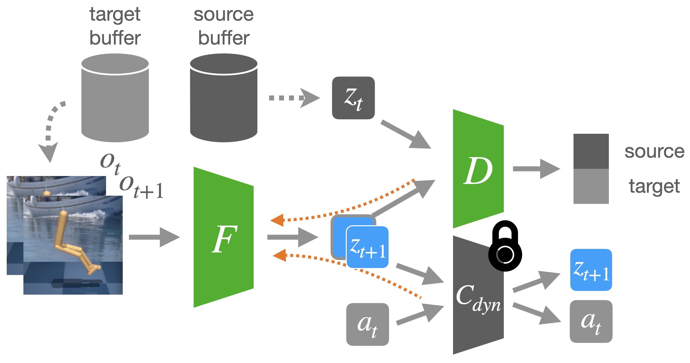

# Invariance Through Inference
Source code will be available shortly.
<!-- PyTorch implementation of Invariance Through Inference (ITI) -->

**Invariance Through Inference**

[Takuma Yoneda\*](https://takuma.yoneda.xyz/), Ge Yang\*, Matthew Walter, Bradly Stadie

[[Paper]](https://arxiv.org/abs/2112.08526) [[Website]](https://invariance-through-inference.github.io/)



If you find our work useful in your research, please consider citing the paper as follows:

```
@misc{yoneda2021invariance,
      title={Invariance Through Inference}, 
      author={Takuma Yoneda and Ge Yang and Matthew R. Walter and Bradly Stadie},
      year={2021},
      eprint={2112.08526},
      archivePrefix={arXiv},
      primaryClass={cs.LG}
}
```

